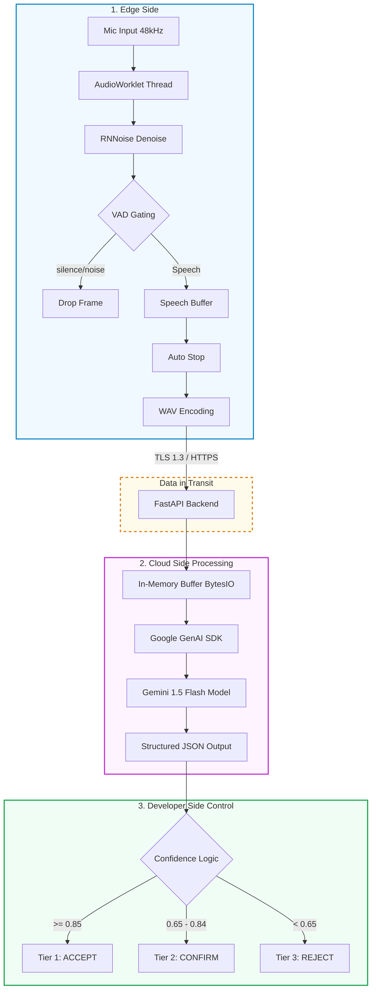

# 🇮🇳 VaakBot: Real-Time Voice Assistant (POC)

This repository contains the proof-of-concept (POC) for VaakBot, a real-time Hinglish voice assistant designed for noisy environments. It demonstrates a low-latency, privacy-first audio processing pipeline using edge-based noise suppression and cloud-based intent routing.

---

## 🎥 Demonstration of the ChatBot
[https://github.com/user-attachments/assets/12345abcde-6789-fghi-jklm-nopqrstuvwxy](https://github.com/CHERRY0456/VAAKBOT/blob/main/Files/VAAKBOT%20Chat%20UI%20(1).mp4)
---

## 🏛️ Original Architecture vs. Tailored POC

The core design of VaakBot is built on a strict **3-Layer Architecture**:

1. **User Side (Edge Layer):** Handles microphone capture, frame processing, RNNoise denoising, and Voice Activity Detection (VAD) gating. Its job is to ensure only clean speech is sent to the network, discarding background noise.
2. **Cloud Side (Processing Layer):** Handles the heavy compute of Speech-to-Text and Intent Recognition. 
3. **Developer Side (Control Layer):** Enforces confidence thresholds to route the query safely (Accept, Confirm, or Reject).

**How I have tailored the POC:**
The original conceptual architecture proposed using enterprise cloud services like Azure Speech-to-Text and Azure OpenAI for the Cloud Side. To build a rapid, highly responsive prototype, we tailored this POC to use the **Google GenAI SDK (Gemini)**. The architectural logic remains exactly the same—only the cloud provider was swapped to demonstrate the pipeline's capabilities efficiently.

---

## 🚀 Upgrades: Old vs. New Files

During development, we upgraded the system from a technical visualization dashboard to a citizen-ready conversational interface. 

### 1. Frontend Upgrades (`old_index.html` ➔ `new_index.html`)
* **The Old File (`old_index.html`):** Served as a technical developer dashboard. It visualized the underlying audio engineering, showing the live waveform, raw VAD probabilities, execution latency metrics, and the step-by-step pipeline state.
* **The New File (`new_index.html`):** Upgraded to a clean, production-style citizen chat interface. 
    * **Interactive Confirmation:** Dynamically displays "Yes/No" chat bubbles when the AI is unsure of the audio.
    * **Auto-Retry:** If the audio is rejected due to noise, the UI automatically re-triggers the microphone after a short delay to try again.

### 2. Backend Upgrades (`old_backend.py` ➔ `new_backend.py`)
* **The Old File (`old_backend.py`):** Used a basic prompt and a legacy Gemini integration. It successfully transcribed audio but relied on hardcoded confidence scores and static English UI responses.
* **The New File (`new_backend.py`):** A massive upgrade using the latest Google GenAI SDK and strict memory handling.
    * **Structured Outputs (Pydantic):** We forced the LLM to strictly adhere to a JSON schema (`GeminiEvaluation`). This completely eliminates API crashes caused by unpredictable AI text formatting.
    * **Dynamic Mother-Tongue Translation:** The AI now listens to the audio, detects the dialect/language, and dynamically returns the `ui_confirm` and `ui_reject` strings translated into the exact language the user spoke.
    * **Memory Safety:** Added `ensure_48khz_wav` to strictly format the audio bytes in volatile RAM (`io.BytesIO`) before sending them to the LLM, ensuring perfect compatibility without writing to the physical disk.

---
## 🏛️ System Architecture

The core design of VaakBot is built on a strict **3-Layer Architecture** to optimize speed and reduce unnecessary network payloads.


## 💻 How to Run
**1. Install dependencies:**
```bash
pip install fastapi uvicorn pydantic google-genai python-dotenv python-multipart
```
**2. Configure your API Key:**
Create a .env file in the root directory and add your key:
```bash
GEMINI_API_KEY="your_api_key_here"
```
**3. Start the upgraded backend:**
```Bash
uvicorn new_backend:app --host 0.0.0.0 --port 8000 --reload
```

**4. Serve the frontend:**
Use Python's local HTTP server to bypass browser microphone security policies for local files:
```Bash
python -m http.server 3000
```
**5. Test the UI:**
Open your browser and navigate to "http://localhost:3000" to test the Voice Chatbot.
---
## 🧑‍💻 Developed By : V. Jai Sri Charan 
