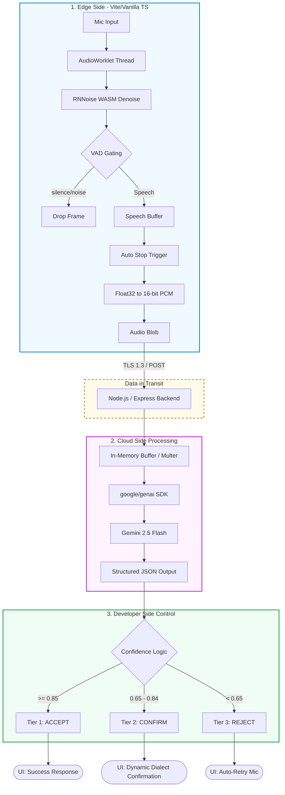

# 🎙️VaakBot: Real-Time Voice Assistant (POC)


This repository contains the proof-of-concept (POC) for VaakBot, a real-time voice assistant designed for noisy environments. It demonstrates a low-latency, privacy-first audio processing pipeline using edge-based noise suppression and cloud-based intent routing.

## 📂 Folder Architecture
```
VAAKBOT/
├── vaakbot-frontend/           # Edge Layer: Client-side UI & Audio Engineering
│   ├── public/                 # Static assets
│   ├── src/
│   │   └── main.ts             # VAD gating, RNNoise WASM, AudioWorklet logic
│   ├── index.html              # Citizen-ready chat interface
│   ├── package.json            # Frontend dependencies (Vite)
│   └── tsconfig.json           # Strict TS configuration
│
├── vaakbot-backend/            # Cloud & Logic Layer: Secure API & AI Orchestration
│   ├── server.ts               # Express endpoints, RAM buffering, Gemini SDK integration
│   ├── package.json            # Backend dependencies (@google/genai, express, multer)
│   ├── tsconfig.json           # Node.js TS configuration
│   └── .env                    # (Git ignored) Secure storage for GEMINI_API_KEY
│
├── .gitignore                  # Master gitignore for node_modules and .env
└── README.md                   # Architecture documentation
```
**Follow the exact architecture to run the things smoothly**

## 🏗️ Architecture 



## 🚀 Upgrades: Python POC to TypeScript Monorepo
The system has been heavily upgraded from its initial Python/FastAPI iteration into a modern, production-ready TypeScript stack.

**1. Frontend Upgrades (Vite + Vanilla TS)**:
Citizen-Ready Interface: Upgraded from a developer debugging dashboard to a clean, highly responsive chat UI.

Interactive Confirmation: Dynamically displays conversational chat bubbles when the AI is unsure of the audio.

Auto-Retry & Self-Healing: If the audio is rejected due to noise, the UI automatically resets the Web Audio API context and re-triggers the microphone after a 1.5-second delay to try again without user intervention.

**2. Backend Upgrades (Node.js + Express)**:
Zero-Disk Processing: Replaced Python's io.BytesIO with Node.js multer.memoryStorage(). The backend reconstructs standard 48kHz WAV headers directly in RAM, ensuring zero trace files are left on the server.

Strict Structured Outputs: The new @google/genai SDK enforces a strict TypeScript-mapped JSON schema (Type.OBJECT). This eliminates hallucinated text and guarantees predictable API responses.

Dynamic Mother-Tongue Translation: Governed by strict systemInstructions, the AI listens to code-switched audio (e.g., Hinglish) and dynamically returns the ui_confirm and ui_reject strings translated into the exact regional dialect the user spoke.

## 💻 How to Run Locally
**Prerequisites**:

1. Node.js (v18 or higher)

2. A valid Google Gemini API Key

**Step 1: Start the Backend Core**:
- Open a terminal and navigate to the backend folder:

```Bash
cd vaakbot-backend
```
- Install dependencies:

```Bash
npm install
```
- Create a .env file in the vaakbot-backend directory and add your API key:

```Code snippet
GEMINI_API_KEY="your_actual_api_key_here"
PORT=8000
```
- Start the server (runs via tsx for seamless TypeScript execution):

```Bash
npm run dev
```

The server will securely listen on http://localhost:8000.

**Step 2: Start the Frontend UI**: 
- Open a new terminal window and navigate to the frontend folder:

```Bash
cd vaakbot-frontend
```

- Install dependencies:

```Bash
npm install
```

- Launch the Vite development server:

```Bash
npm run dev
```

Open the provided localhost link (typically http://localhost:5173) in your browser to interact with VaakBot.
